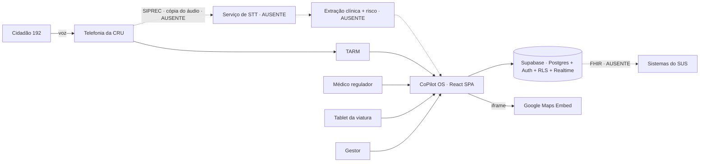
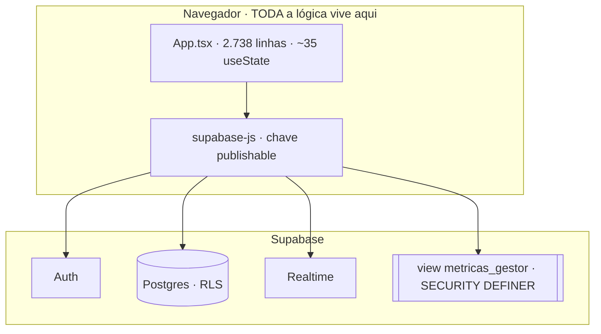
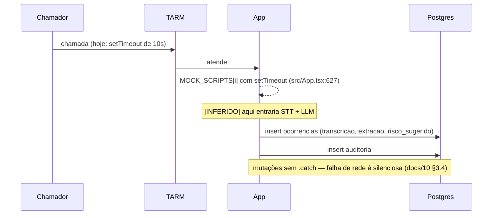
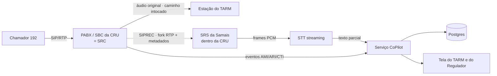

# Parecer técnico independente — Samais CoPilot OS

**Data:** 13/08/2026
**Método:** análise executada sob o protocolo de `hugo1.md` (ETAPAS 1–7), sobre
`docs/15-onboarding-hugo.md` (DOCUMENTO 1 — onboarding) e `docs/16-handoff-analise-hugo.md`
(DOCUMENTO 2 — handoff), com verificação factual do repositório **em leitura apenas**.
**Nenhum repositório foi clonado. Nenhum arquivo do projeto foi alterado.** Este documento
é o único arquivo criado.

> **Aviso de método, antes de tudo:** `hugo1.md` está **truncado**. O arquivo tem 409 linhas
> e termina no meio da palavra `exposição de serv` (ETAPA 7 — Análise de Segurança). As
> ETAPAS 8+ que o texto sugere existir — os objetivos 12 a 16 do próprio arquivo: plano de
> execução, decisões que precedem o desenvolvimento, perguntas às equipes, ordem de
> atividades e critérios de validação de cada entrega — **não estão no arquivo**. Este
> parecer executa as ETAPAS 1–7 conforme especificadas e sinaliza ao final o que ficou sem
> instrução.

> **Nota de nomenclatura:** `docs/16` §Registro reserva este nome (`17-parecer-hugo.md`)
> para a resposta do Hugo. Existe também `docs/17-consideracoes-hugo.md`, produzido em
> 12/08/2026 sob outro protocolo (as sete perguntas de `docs/16`). São documentos distintos,
> de métodos distintos, e convivem. Onde este parecer contraria aquele, prevalece a evidência
> citada com arquivo e linha.

---

## ETAPA 1 — Inventário dos documentos

### DOCUMENTO 1 — `docs/15-onboarding-hugo.md`

| Campo | Conteúdo |
|---|---|
| Objetivo aparente | Onboarding humano de um candidato (Hugo) a dev/treinador/implantador; define escada de acesso e regras de trabalho |
| Data | 11/08/2026 (§Registro) |
| Autor | Não nomeado; "Ota" é o executor da Parte A |
| Público-alvo | Duplo — Parte A para o Ota, Parte B para o Hugo |
| Completude | **Alta para orientação, baixa para execução técnica** — delega detalhe a `docs/07,08,10,12,14` |
| Temas | Escopo do produto, estado real vs. demo, três frentes de trabalho, setup local, regras invioláveis |
| Limitação central | Autodeclaratório: afirma percentuais e estados sem evidência anexada |
| Informação ausente | Remuneração, escopo contratual, prazo, quem é o responsável técnico médico, nome do próprio Hugo (campos "_a preencher_") |

### DOCUMENTO 2 — `docs/16-handoff-analise-hugo.md`

| Campo | Conteúdo |
|---|---|
| Objetivo aparente | Prompt autocontido para IA produzir parecer independente; instrumento de avaliação mútua |
| Data | 11/08/2026 |
| Completude | **Alta como prompt, média como fonte** — é um pedido de análise, não uma descrição de sistema |
| Limitação central | Contém **os únicos números financeiros do conjunto** (R$ 600–4.400/central/mês; R$ 0,20/atendimento) sem memória de cálculo — remete a `docs/11` |
| Ponto forte | Instrui explicitamente "trate como hipótese, não como dado" sobre as próprias afirmações |

### Avaliação de qualidade documental

| Critério | Classificação | Justificativa |
|---|---|---|
| Clareza | **Alta** | Linguagem direta, sem eufemismo. "É teatro determinístico" (`15` §B.2) é o oposto do vício comum |
| Consistência interna | **Alta** | 15 e 16 concordam em todos os pontos materiais |
| Consistência com o código | **Média** | Três divergências verificáveis (ETAPA 3) |
| Atualidade | **Alta** | Datados de 11/08/2026, repositório com modificação de 12/08 |
| Rastreabilidade | **Média** | Cita documento e seção, quase nunca arquivo e linha. `docs/16` exige do analista o que ele próprio não faz |
| Detalhamento | **Baixa** | São documentos-índice; nenhum requisito funcional, nenhum critério de aceite operacionalizável |
| Capacidade de orientar execução | **Baixa isoladamente / Média com o corpus** | Ninguém constrói nada só com 15 e 16 |

**Observação de mérito, que é rara:** o par 15/16 pratica o que declara. Um documento de
onboarding que abre com "a demo é convincente; ela é, em boa parte, teatro determinístico" e
estima 15–20% inverte o incentivo natural de quem recruta. Isso vale mais que a maioria das
seções técnicas, porque calibra a confiança em tudo o mais.

---

## ETAPA 2 — Extração e classificação dos elementos

| ID | Elemento | Categoria | Origem | Trecho | Status | Confiança | Observação |
|---|---|---|---|---|---|---|---|
| E-01 | Apoio à operação de CRU (192) | Objetivo | 15, 16 | §B.1 / "O sistema" | Em desenvolvimento | Alta | Coincidente nos dois |
| E-02 | Copiloto, não piloto — decisão é do médico | Regra de negócio | 15, 16 | §B.1.1 | Existente (parcial) | Alta | Campo `divergencia_justificativa` existe em `schema.sql` |
| E-03 | Nunca derrubar o 192; cópia do áudio | Req. não funcional | 15, 16 | §B.1.2 | Planejado | Alta | Sem implementação — não há telefonia |
| E-04 | Modo degradado (desligar IA, tudo manual) | Req. não funcional | 15, 16 | §B.1.2 | Planejado | Média | Existe `aiActive` no front (`src/App.tsx:358`), mas degradar um mock não prova nada |
| E-05 | Perfis TARM / REGULADOR / VIATURA / GESTOR / ADMIN_TENANT | Usuários | 15 | §B.2 | **Existente** | Alta | `supabase/schema.sql:31` — o doc lista 4, o schema tem 5 |
| E-06 | Login por matrícula (e-mail sintético) | Processo | 15 | §B.2 | Existente | Alta | `src/lib/supabase.ts:21-23` |
| E-07 | Frota, escalas, ocorrências T0–T4 | Componente | 15, 16 | §B.2 | Existente | Alta | Tabelas `viaturas`, `escalas`, `despachos` |
| E-08 | Auditoria append-only | Segurança | 15, 16 | §B.2 | Existente parcial | Alta | Tabela existe; imutabilidade real depende da migration não aplicada |
| E-09 | **Triagem por IA — não existe** | Limitação | 15, 16 | §B.2 | **Ausente** | Alta | `MOCK_SCRIPTS` em `src/App.tsx:231` — confirmado |
| E-10 | SIPREC / telefonia | Integração | 15, 16 | §B.2 | Não iniciado | Alta | Zero código |
| E-11 | Hash encadeado escrito e não aplicado | Pendência | 15, 16 | §B.2 | **Pendente** | Alta | `supabase/migrations/0001_audit_hash_chain.sql` existe |
| E-12 | Exportação FHIR / APH-BR = `JSON.stringify` | Limitação | 15 | §B.2 | Ausente | Alta | — |
| E-13 | **15–20% do caminho** | Métrica | 15, 16 | §B.2 / "afirma hoje" | Alegação | Média | Sem definição de denominador |
| E-14 | Tier 0 de segurança (SEC-01 a SEC-07) | Segurança | 15, 16 | §B.3 / parte 4 | Pendente | Alta | `docs/07` tem SEC-01..07 + 10..20 |
| E-15 | **Gate ≥90% de concordância / ≥1.000 chamadas** | Critério de aceite | 15, 16 | §B.3.2 | Planejado | Alta | Único critério de aceite numérico de todo o corpus |
| E-16 | Revisão por responsável técnico médico | Responsável | 15, 16 | §B.3.2 | Planejado | Média | **Pessoa não identificada** |
| E-17 | React 19 + Vite 6 + TS + Tailwind v4 | Sistema | 15, 16 | §B.4 | Existente | Alta | `package.json` confere |
| E-18 | Supabase (Postgres/Auth/RLS/Realtime) | Banco | 15, 16 | §B.4 | Existente | Alta | — |
| E-19 | Vercel | Deploy | 15, 16 | §B.4 | Existente | Alta | `vercel.json` com CSP/HSTS reais |
| E-20 | `service_role` nunca no front | Segurança | 15 | §B.4 | Regra | Alta | Regra respeitada quanto ao Supabase — **violada quanto ao Gemini** (ver F-04) |
| E-21 | `App.tsx` "monolito de ~2 mil linhas" | Dívida técnica | 15, 16 | §B.3 | Existente | Alta | **São 2.738 linhas** — divergência |
| E-22 | Sem ESLint, sem teste, sem CI | Dívida | 15, 16 | §B.4 | Existente | Alta | Confirmado: sem `.github/`, `lint` = `tsc --noEmit` |
| E-23 | Custo R$ 600–4.400/central/mês; R$ 0,20/atendimento | Custo | **16 apenas** | "afirma hoje" | Alegação | **Baixa** | Ausente no onboarding; premissas não visíveis |
| E-24 | Branch + PR, nada na `main` | Processo | 15 | §B.6 | Existente | Média | Sem CODEOWNERS nem branch protection verificável |
| E-25 | Repositório público | Governança | 15, 16 | Cabeçalho | Existente | Alta | Decisão com consequências (ver F-07) |
| E-26 | Escada de acesso em 5 degraus | Acesso | **15 apenas** | §A.2 | Planejado | Alta | Ausente no handoff |
| E-27 | Nenhum dado real de paciente antes do Tier 0 | Regra | 15 | §B.7.2 | Vigente | Alta | Regra mais importante do documento |
| E-28 | Deepgram | Fornecedor | **Nenhum dos dois** | `docs/14` §1 | Incerto | Baixa | Nomeado só no runbook, como se já fosse decisão |
| E-29 | `@google/genai ^1.29.0` instalado | Dependência | **Nenhum dos dois** | `package.json` | Existente, **não usado** | Alta | Contradiz "sem LLM" na forma, não no fato |
| E-30 | Ambientes dev/homolog/prod | Ambiente | 15 §A.2 (parcial) | — | **Não informado** | — | Cita "projeto de desenvolvimento" e "de demonstração"; **homologação não existe no material** |
| E-31 | Backup, RPO, RTO, DR | Infra | — | — | **Não informado no material analisado** | — | Nem 15 nem 16 mencionam; `docs/07` SEC-06 trata |
| E-32 | Monitoramento, alertas, on-call | Operação | — | — | **Não informado no material analisado** | — | Lacuna grave para serviço de urgência |
| E-33 | Plano de rollback / continuidade | Operação | — | — | **Não informado** | — | Exigido explicitamente pela ETAPA 3 do `hugo1.md` |

---

## ETAPA 3 — Consolidação entre onboarding e handoff

| Tema | Onboarding (15) | Handoff (16) | Situação consolidada | Conflito / lacuna | Severidade | Ação |
|---|---|---|---|---|---|---|
| Objetivo do produto | §B.1 | "O sistema" | Idênticos | Nenhum | — | — |
| Tamanho do `App.tsx` | "~2 mil linhas" | "~2 mil linhas" | **2.738 linhas** (`src/App.tsx`) | **CONTRADIÇÃO** com o código; `docs/10` §3.1 diz "~2.7k" e acerta | Baixa (técnica) / **Alta (sinal)** | Corrigir 15 e 16 — 37% de subestimação num número que qualquer um confere em 3 segundos corrói a confiança em números que ninguém confere |
| Perfis de usuário | 4 perfis | não lista | Schema tem **5** (`ADMIN_TENANT`) | Lacuna | Média | Documentar o 5º — é o papel com mais poder |
| Custo de plataforma | **ausente** | R$ 600–4.400 + R$ 0,20 | Só no handoff | Lacuna | Média | Números vão ao candidato sem irem ao onboarding; sem memória de cálculo |
| Escada de acesso | §A.2 detalhada | ausente | Só no onboarding | Lacuna assimétrica | Baixa | Correto por design (16 é público-colável) |
| Fornecedor de STT | ausente | "qual serviço você usaria?" (pergunta aberta) | **`docs/14` §1 já cita "Deepgram" como segredo a inventariar** | **CONTRADIÇÃO** | Média | Ou a decisão foi tomada e o handoff finge que não, ou o runbook antecipou uma decisão inexistente. Perguntar qual |
| Presença de LLM | "sem STT, sem LLM" | "sem modelo de linguagem" | `@google/genai@1.29.0` **está instalado** e `vite.config.ts:11` injeta `GEMINI_API_KEY` no bundle | **CONTRADIÇÃO material** | **Crítica** | Ver F-04. Não é "sem LLM" — é "com o encanamento de LLM montado e nenhum uso" |
| Modo demo sem credencial | "sem chave, cai em modo demo" (§B.4) | — | **Falso.** `src/lib/supabase.ts:9-13` traz URL e chave publishable do projeto real **hardcoded como fallback** | **CONTRADIÇÃO** | **Alta** | Ver F-05 |
| Ambiente de homologação | não existe no material | não existe | **Ausente** | Lacuna | Alta | Sem homolog, o gate de 90% e o Tier 0 são testados onde? |
| Rollback / continuidade | ausente | ausente | **Ausente** | Lacuna | **Crítica** | Sistema que promete "nunca derrubar o 192" sem plano de rollback documentado |
| Monitoramento / on-call | ausente | ausente | **Ausente** | Lacuna | **Crítica** | Nenhum dos dois documentos menciona quem é acordado às 3h |
| Responsável técnico médico | citado como validador do gate | idem | **Pessoa não identificada** | Lacuna | Alta | O gate inteiro depende de uma assinatura sem dono |
| Critérios de aceite | só o gate de 90% | idem | Um único critério em todo o corpus | Lacuna | Alta | Tier 0, modularização e SIPREC não têm critério de "pronto" |
| Estado da IA | "não existe" | "não existe" | Confirmado no código | Nenhum | — | Honestidade confirmada |

**Padrão que emerge:** as divergências não são de conteúdo, são de **direção única** — todas
subestimam ou omitem, nenhuma exagera. O `App.tsx` é maior, os perfis são mais, a dependência
de LLM já está lá, o fallback de credencial existe. Isso é o oposto de vitrine; é falta de
recontagem. É corrigível com CI.

---

## ETAPA 4 — Modelo do sistema e da operação

### 4.1 Atores

| Ator | Finalidade | Ambiente | Risco | Nível de documentação |
|---|---|---|---|---|
| Solicitante (cidadão) | Origina a chamada 192 | Telefonia pública | Não é usuário do sistema; é **fonte do dado** | Nenhuma |
| TARM | Atende, coleta, aciona | Estação da CRU | Alta carga cognitiva | Média |
| Médico regulador | **Decide.** Classifica, despacha, diverge | Estação da CRU | Autoridade final — SPOF humano por desenho, e isso é correto | Média |
| Equipe de viatura | Marca T1–T4 na cena | Tablet embarcado | Conectividade, sujidade, luva, sol | **Baixa — offline não existe** |
| Gestor | Métricas sem PII | Web | Ver F-01 | Média |
| `ADMIN_TENANT` | Não documentado | — | **Papel mais privilegiado, menos descrito** | **Nenhuma** |

### 4.2 Diagrama de contexto

Linha tracejada = ausente. **Tudo o que é tracejado é o produto.** O que está sólido é o CRUD
ao redor dele.

### 4.3 Arquitetura lógica — o achado estrutural

**Não existe backend próprio.** Nenhuma Edge Function, nenhuma API, nenhum servidor. O cliente
fala direto com o Postgres e **toda a segurança repousa em 11 policies de RLS**. Isso é elegante
e viável para o que existe hoje — e é **incompatível com o produto pretendido**. O momento em
que entra STT, LLM e SIPREC é o momento em que aparece obrigatoriamente um plano servidor,
porque:

- chave de STT/LLM não pode ir ao browser (o `vite.config.ts` já erra exatamente aqui);
- áudio SIPREC não chega no navegador de ninguém;
- a decisão clínica não pode ser computada num contexto que o usuário controla.

Consequência de planejamento que **nenhum documento registra**: o Tier 0 e a substituição do
mock não são frentes paralelas. A segunda **exige** uma camada arquitetural que ainda não foi
decidida — e essa decisão precede ambas.

### 4.4 Fluxo do dado clínico [INFERIDO onde anotado]

### 4.5 Componentes não modelados por ninguém

Fila de múltiplas ocorrências simultâneas · rádio-operador · múltiplas viaturas por ocorrência ·
offline no tablet. `docs/10` §4 os lista; **nem 15 nem 16 os mencionam ao candidato**. São
exatamente os quatro itens que aparecem no primeiro dia de operação real, e três deles dependem
da modularização.

### 4.6 Não informado no material analisado

Backup e recuperação · processo de suporte e operação · observabilidade · filas e jobs ·
rede e conectividade com a CRU · processo de implantação técnica (o `docs/12` descreve fases
de campo, não deploy).

---

## ETAPA 5 — Análise de desenvolvimento

| ID | Achado | Evidência | Impacto | Prob. | Severidade | Recomendação | Critério de conclusão |
|---|---|---|---|---|---|---|---|
| D-01 | Monolito de 2.738 linhas, ~35 `useState` num componente, sem router | `src/App.tsx` | Bloqueia fila multi-ocorrência e qualquer paralelismo de equipe | Certa | **Alta** | Modularizar por domínio; state machine explícita | Nenhum arquivo >400 linhas; fila multi-ocorrência implementável sem tocar em 10 arquivos |
| D-02 | Zero teste, zero CI, zero ESLint | ausência de `.github/`; `"lint": "tsc --noEmit"` | Refactor às cegas num sistema de urgência | Certa | **Crítica** | CI **antes** do refactor — nesta ordem | PR bloqueia com tsc/lint/teste vermelho |
| D-03 | Mutações Supabase sem `.catch` | `docs/10` §3.4 | **UI confirma sucesso em write que falhou.** Num despacho, isso é uma viatura que ninguém mandou | Alta | **Crítica** | Wrapper único de mutação com erro visível + fila offline | Falha de rede injetada produz erro na tela, sempre |
| D-04 | Sem ErrorBoundary | `docs/10` §3.5 | Exceção de render = tela branca no meio de uma regulação | Média | **Crítica** | Boundary por módulo + degradação para manual | Exceção injetada mantém o caminho manual utilizável |
| D-05 | TypeScript sem `strict` | `tsconfig.json`; `docs/10` §3.3 | Único gate de qualidade existente está com o filtro desligado | Certa | Alta | Ligar `strict` incrementalmente | `strict: true` sem `@ts-ignore` novo |
| D-06 | `@google/genai` instalado e não usado | `package.json` vs. ausência de uso em `src/` | Superfície de supply-chain sem contrapartida; contradiz a doc | Certa | Média | Remover ou usar | Dependência justificada ou fora |
| D-07 | Acessibilidade: `user-scalable=no`, 8 `aria-label` no app inteiro | `docs/10` §3.7 | **Compra pública tem exigência legal de acessibilidade** — vira item de edital, não de backlog | Alta | Alta | WCAG 2.1 AA no que é operacional | Auditoria AA sem bloqueante |
| D-08 | Sem versionamento de banco (schema colado à mão no SQL Editor) | cabeçalho de `supabase/schema.sql` | Deriva entre ambientes; impossível reproduzir | Alta | Alta | Supabase CLI + migrations versionadas | Ambiente recriado do zero por comando |

**Classificação das recomendações:**
Correção imediata → D-02, D-03, D-04. Melhoria de curto prazo → D-05, D-06, D-08.
Evolução de médio prazo → D-01, D-07.

**Ordem que eu inverteria em relação a `docs/15` §B.3:** o onboarding coloca modularização em
terceiro e CI dentro dela. Está errado. **CI e testes vêm antes de tudo**, porque são o
instrumento que torna o resto seguro — e porque teriam pego, sozinhos, o erro de 2.000 vs.
2.738 linhas e a chave no bundle.

---

## ETAPA 6 — Análise de infraestrutura

| Domínio | Estado atual | Risco | Lacuna | Recomendação | Prioridade | Dependência |
|---|---|---|---|---|---|---|
| Ambientes | dev + demo | **Sem homologação** | Onde se valida o Tier 0 e o gate de 90%? | Criar homolog com dado sintético | **Crítica** | Orçamento Supabase |
| Servidores | Nenhum — só SPA + BaaS | Não escala para STT/SIPREC | **Plano servidor inexistente** | Decidir a camada antes de codar IA | **Crítica** | Decisão arquitetural |
| Cloud | Vercel + Supabase (São Paulo) | Lock-in duplo | Sem estratégia de saída | Registrar como risco aceito | Média | — |
| Rede | HTTPS público | SIPREC exige rede da CRU | **Conectividade com a central não desenhada** | Levantar em campo | Alta | Acesso à CRU |
| Certificados / headers | CSP, HSTS, X-Frame reais em `vercel.json` | CSP com hash inline frágil (`docs/14` §2 avisa) | — | Manter; automatizar o cálculo do hash | Baixa | — |
| Banco | Postgres gerenciado | Sem réplica declarada | RPO/RTO **não informados** | Definir e testar | **Crítica** | — |
| Backup / restore | **Não informado nos dois documentos** | Perda de registro clínico | Restore nunca testado | Backup imutável + restore trimestral cronometrado | **Crítica** | SEC-06 |
| Disaster recovery | **Não informado** | — | — | Plano com RPO/RTO explícitos | Crítica | — |
| Monitoramento / alertas / logs | **Não informado nos dois documentos** | **Falha silenciosa em serviço de urgência** | Não há observabilidade nenhuma | Uptime + erro + alerta com destinatário nomeado | **Crítica** | — |
| Capacidade | Nunca medida | Realtime com dezenas de operadores é desconhecido | Sem teste de carga | Teste de carga antes do piloto | Alta | Homolog |
| Custos | R$ 600–4.400/mês (só em `docs/16`) | Custo de STT+LLM **não está nessa conta** | Premissas invisíveis | Recompor com STT/LLM/observabilidade | Alta | Escolha de fornecedor |
| Gestão de configuração | Manual (SQL Editor, painel Vercel) | Deriva | Sem IaC | Versionar o que der | Média | — |

### Identificação explícita exigida pela ETAPA 6

- **Pontos únicos de falha:** Vercel · Supabase · Google Maps · **médico regulador** (humano,
  por desenho correto). Queda do Supabase = sistema inteiro fora, e **nenhum documento diz o
  que a CRU faz nesse minuto**. A promessa "nunca derrubar o 192" cobre o *caminho da chamada*,
  não cobre o *caminho do despacho* — e é o despacho que o sistema já opera hoje.
- **Componentes sem backup:** não informado — logo, presumir nenhum testado.
- **Componentes sem monitoramento:** todos.
- **Acessos excessivos:** ver F-08 (gestão de usuários só por `service_role`).
- **Ambientes inexistentes:** homologação.
- **Configuração manual:** schema do banco, variáveis Vercel, chave Google.
- **Recursos sem proprietário:** o responsável técnico médico do gate (E-16).
- **Componentes sem plano de recuperação:** todos.

---

## ETAPA 7 — Análise de segurança (defensiva)

`hugo1.md` trunca aqui, na enumeração dos itens a avaliar. Segue-se pela lista visível
(autenticação, autorização, segregação de funções, menor privilégio, MFA, gestão de identidades,
rotação de credenciais, armazenamento de segredos, exposição de serviços) mais o que o código
impõe.

### Achados — nenhum destes está em qualquer documento do repositório

#### F-01 · `metricas_gestor` vaza dados entre tenants — **CRÍTICO**

`supabase/schema.sql:150-160`. A view é criada `with (security_invoker = false)` — executa com
privilégio do owner, **contornando o RLS das tabelas base** — e **não tem
`where tenant_id = meu_tenant()`**. Views não possuem RLS própria. Resultado: qualquer usuário
autenticado que consulte `metricas_gestor` obtém volume de chamadas, contagem de vermelhos,
divergências e tempo médio de resposta **de todas as centrais clientes**.

A doutrina "gestor sem PII por construção" (`docs/10` §2) está correta, e é justamente o
mecanismo que a implementa que vaza — para o lado do multi-tenancy, não da PII. Num produto
vendido a municípios concorrentes sobre a mesma plataforma, é vazamento comercial e contratual.

*Correção:* `security_invoker = true` **e** predicado de tenant dentro da view.

#### F-02 · Auditoria pode ser forjada em nome de terceiro — **ALTO**

`supabase/schema.sql:145-146`:
`create policy auditoria_insert on auditoria for insert with check (tenant_id = meu_tenant())`.
Não há `usuario_id = auth.uid()`. Qualquer usuário do tenant insere registro de auditoria
atribuído a **qualquer outro operador**, com qualquer `acao` e qualquer `alvo`.

O hash-chain da migration `0001` **não corrige isso** — ele garante que o registro não foi
alterado *depois*, não que era verdadeiro *quando gravado*. Uma cadeia de custódia
criptograficamente íntegra de um registro forjado na origem é pior que nenhuma, porque sustenta
uma afirmação falsa em juízo.

*Correção:* `with check (tenant_id = meu_tenant() and usuario_id = auth.uid())`.

#### F-03 · Hash-chain tem condição de corrida e dependência de sessão — **ALTO**

`supabase/migrations/0001_audit_hash_chain.sql`, função `auditoria_encadear()`:

1. **Corrida.** Lê `select hash_atual ... order by id desc limit 1` sem lock. Dois inserts
   concorrentes — **o caso normal numa CRU com dezenas de operadores** — leem o mesmo `prev` e
   produzem uma bifurcação. `verificar_cadeia_auditoria()` passa a acusar adulteração onde só
   houve concorrência.
2. **Determinismo.** `_auditoria_payload` serializa `created_at::text`, cuja saída depende de
   `DateStyle`/`TimeZone` da sessão — a mesma linha verifica ou não conforme quem verifica.
3. **Cobertura.** Os gatilhos de imutabilidade são `for each row`; **`TRUNCATE` não dispara
   nenhum deles**.

Consequência de projeto: a migration é apresentada em `docs/15` §B.2 e `docs/16` como "escrita,
falta aplicar". **Ela não está pronta para aplicar.** Aplicá-la como está produz falsos
positivos de adulteração em produção — o pior resultado possível para um controle cuja função
é ser confiável.

#### F-04 · Chave do Gemini injetada no bundle do cliente — **CRÍTICO se a variável for definida**

`vite.config.ts:11`:
`define: { 'process.env.GEMINI_API_KEY': JSON.stringify(env.GEMINI_API_KEY) }`.

`define` faz substituição textual no bundle: se a variável existir no ambiente de build, **a
chave vai literal para o JavaScript público**. Isto contradiz frontalmente `.env.example`
("Nenhum segredo vive no código-fonte") e o princípio de `docs/15` §B.4 — que enuncia a regra
corretamente para o Supabase e não percebe que a viola para o Google. Note que o prefixo
`VITE_`, que é a proteção nativa do Vite contra exatamente isso, foi **contornado** aqui.

Fica dormente hoje só porque nada usa a chave; é uma armadilha armada para o dia em que a IA
entrar. `docs/07` SEC-01 trata de rotação de segredos e **não cita esta linha**.

#### F-05 · Credenciais do projeto real embutidas como fallback — **MÉDIO**

`src/lib/supabase.ts:9-13` traz URL e `publishable key` do projeto Supabase da Samais
hardcoded. A chave é pública por design — o problema não é ela, é o comportamento: `docs/15`
§B.4 promete "sem chave, cai em modo demo", mas o que o código faz é **conectar ao backend
real**. Qualquer fork do repositório público, qualquer dev sem `.env`, qualquer CI aponta para
lá por padrão. Combinado com F-01, deixa de ser detalhe: superfície de leitura entre tenants
alcançável a partir de um repositório público.

#### F-06 · MFA é card sem handler — **ALTO**

`src/App.tsx:972` exibe "MFA (TOTP) — habilitação em produção". `docs/10` §2 admite: sem
handler. É SEC-03, ainda aberto. Enquanto isso, o login é `matricula@tenant.samais.app` +
senha — e matrícula é **previsível e pública dentro da central** (`TARM-04`, `REG-02`), o que
reduz a autenticação a um fator adivinhável mais uma senha. Sem MFA, sem rate limit próprio e
sem política de senha declarada.

#### F-07 · Repositório público com schema completo — **ACEITO, com preço não registrado**

Publicar o código é decisão legítima e `docs/15` a assume. O que nenhum documento registra é a
consequência: o schema, as policies de RLS, o endpoint do Supabase e o desenho do controle de
acesso são **públicos e legíveis por qualquer um antes de o Tier 0 fechar**. F-01 e F-02 são
localizáveis por leitura, sem acesso nenhum. A regra "nada de dado real antes do Tier 0"
(§B.7.2) é exatamente o que mantém isso sob controle — e é por isso que ela não pode ceder um
dia sequer.

#### F-08 · Sem gestão de identidade dentro do produto — **MÉDIO**

Não há policy de `insert`/`update` em `usuarios` (`supabase/schema.sql:128`). Criar operador,
desativar demitido, trocar papel: tudo exige `service_role` fora da aplicação, manualmente.
Numa central com rotatividade de plantão, **o offboarding vira processo humano não rastreado**
— e nenhum dos dois documentos menciona que ele existe. Menor privilégio sem processo de
revogação é menor privilégio no papel.

### Consolidação de segurança

| Item | Estado | Onde falha | Doc que trata |
|---|---|---|---|
| Autenticação | Parcial | Fator único, matrícula previsível (F-06) | SEC-03 |
| Autorização / RLS | **Furada** | F-01, F-02 | SEC-04 (não os identifica) |
| Segregação de funções | Boa no desenho | `ADMIN_TENANT` não documentado | — |
| Menor privilégio | Parcial | F-08 | SEC-04 |
| MFA | Ausente | F-06 | SEC-03 |
| Rotação de credenciais | Pendente | `docs/14` §1 | SEC-01 |
| Armazenamento de segredos | **Violado** | F-04 | Nenhum |
| Exposição de serviços | Ampla por arquitetura | Postgres direto ao browser | Nenhum |
| Integridade da auditoria | **Falsa sensação** | F-02 + F-03 | SEC-05 (subestima) |

**Conclusão da ETAPA 7:** `docs/07` §Tier 0 **não é suficiente** para liberar dado real de
paciente. Faltam nele, no mínimo, F-01, F-02, F-03 e F-04 — e três dos quatro são de baixo
custo de correção e alto custo de omissão. **Nenhum é encontrável lendo apenas `docs/15` e
`docs/16`**; todos aparecem em vinte minutos de leitura do que esses documentos apontam.

---

## Leitura de conjunto

### Sobre os "15–20%"

Medido em *superfície entregue*, é generoso; medido em *risco resolvido*, é otimista. O CRUD ao
redor do produto está feito, e bem feito. O produto — IA sobre áudio de emergência em português
sob estresse, com fallback auditável — não começou, e a arquitetura atual (SPA + BaaS, sem plano
servidor) **não comporta** que ele comece. Antes da primeira linha de STT há uma decisão de
arquitetura que não está tomada em documento nenhum.

Não se trata de corrigir o número, e sim de trocar a régua: **"15–20% da superfície, 0% do
núcleo, e uma decisão arquitetural bloqueando o núcleo"**.

### Sobre o gate de 90%

É o melhor item dos dois documentos e o mais frágil. Concordância com a decisão do regulador
mede alinhamento com a prática vigente, **não acerto clínico** — se a IA e o médico erram junto,
o gate acende verde. E 90% agregado esconde a distribuição que importa: a taxa de sub-triagem no
vermelho. Um sistema com 95% global e 12% de vermelhos rebaixados é pior que um com 85% e zero.

O gate precisa de um segundo critério, **assimétrico**, sobre subclassificação de risco alto —
e ele não existe hoje.

### Sobre o material em si

Documentação que declara o próprio teatro é rara e vale muito. O que falha não é honestidade, é
**verificação**: os três erros encontrados (linhas do `App.tsx`, "cai em modo demo", "sem LLM")
são todos do tipo que um CI pega. É consistente com a ausência de CI ser a dívida nº 2 da lista
— a mesma lacuna que deixa o código sem rede deixa o documento sem rede. `docs/15` §B.6 diz que
documento desatualizado conta como bug; a instrumentação para fazer valer é a peça faltante.

### O que eu recusaria nas condições atuais

- Aplicar a migration `0001` como está (F-03).
- Qualquer contato com dado real de paciente antes de F-01, F-02 e F-04 fecharem — o que, na
  prática, é a regra §B.7.2 que a própria equipe escreveu, apenas com quatro itens a mais na
  lista.

---

## Perguntas que precisam de resposta antes do desenvolvimento

1. **Arquitetura:** haverá camada servidor própria (Edge Functions, serviço dedicado)? Sem
   decisão, STT/LLM/SIPREC não começam.
2. **STT:** Deepgram é decisão tomada (`docs/14` §1) ou hipótese (`docs/16` pergunta)?
3. **Responsável técnico médico:** quem assina o gate de 90%?
4. **Homologação:** existe orçamento para um terceiro projeto Supabase?
5. **Dado rotulado:** as 1.000 chamadas anonimizadas existem, ou é premissa? De quem é o acervo,
   e sob que base legal se usa?
6. **On-call:** quem responde quando o sistema cai às 3h da manhã durante um plantão?
7. **Custo:** os R$ 600–4.400/mês incluem STT e LLM? Se não, qual é o número com eles?

---

## Etapas não executáveis

`hugo1.md` termina no meio da ETAPA 7. Os objetivos 12 a 16 do próprio arquivo — o que fazer
para colocar/manter/evoluir o sistema em produção, quais decisões precedem o desenvolvimento,
que informações solicitar às equipes, qual a ordem de execução das atividades e como validar
cada entrega — **não têm método definido no material recebido**. As sete perguntas acima e os
critérios de conclusão das ETAPAS 5 e 6 cobrem parte disso; o restante fica em aberto até que a
continuação do `hugo1.md` seja fornecida, para que as etapas restantes sejam executadas sob o
método pretendido em vez de um improvisado.

---

## Registro

Produzido em 13/08/2026 sob o protocolo de `hugo1.md` (ETAPAS 1–7, arquivo truncado na 7).
Fontes primárias: `docs/15-onboarding-hugo.md` e `docs/16-handoff-analise-hugo.md`.
Verificação factual em leitura sobre: `package.json`, `vite.config.ts`, `vercel.json`,
`.env.example`, `src/App.tsx`, `src/lib/supabase.ts`, `supabase/schema.sql`,
`supabase/migrations/0001_audit_hash_chain.sql`, `docs/07`, `docs/10`, `docs/14`.

Nenhum clone foi realizado e nenhum arquivo existente do projeto foi alterado.

Pareia com `docs/17-consideracoes-hugo.md` (12/08/2026, protocolo das sete perguntas de
`docs/16`) — documentos distintos, métodos distintos.

---
---

# ADENDO A — Banco de dados, plataforma, STT e captação pelo PABX

> Acrescentado em 13/08/2026, a pedido do Ota, respondendo a três perguntas diretas:
> (1) qual banco de dados e qual plataforma para máxima segurança e disponibilidade;
> (2) qual modelo de IA para transcrever a chamada vinda do PABX;
> (3) como usar a API do PABX para chegar ao áudio.
>
> Vale a regra de `docs/16`: **nenhum número inventado**. Onde a resposta correta é "isto se
> mede, não se estima", está escrito assim. Onde há fato de protocolo ou de produto, está
> citado como fato.

---

## A.1 Banco de dados

### A.1.1 O motor não muda: PostgreSQL

Não trocaria. Não por conservadorismo — porque para este problema o Postgres é a escolha
tecnicamente superior, e a lista de razões é específica, não genérica:

| Necessidade do CoPilot | Recurso nativo do Postgres |
|---|---|
| Isolamento entre centrais | **RLS** — política no banco, não na aplicação. É a única forma de o isolamento sobreviver a um bug de front |
| Auditoria com hash encadeado | `pgcrypto` + triggers (é o que a migration `0001` já faz) |
| Trilha de acesso ao dado clínico | **`pgaudit`** — quem leu qual prontuário, não só quem escreveu. **Ninguém pediu isso ainda, e a LGPD vai pedir** |
| Cofre de PII separado (SEC-10/11) | Schemas distintos + `GRANT` por papel + cifragem em nível de campo |
| Recuperação a ponto no tempo | **PITR** por WAL — restaura o estado de um minuto específico, que é o que se exige de registro clínico |
| Dado semiestruturado (transcrição, extração) | `jsonb`, já usado no `schema.sql` |
| Tempo real para a operação | Realtime/`LISTEN`-`NOTIFY`/replicação lógica |

Trocar de motor (Mongo, MySQL, SQL Server) custaria RLS, `pgaudit` e PITR de qualidade —
os três pilares do que torna este sistema defensável perante ANPD, TCU e Ministério Público.
**A decisão a tomar não é o motor. É como o Postgres é operado.**

### A.1.2 Como operar — três degraus, atados a gates, não a datas

| Degrau | Quando | Plataforma | O que se ganha | O que se aceita |
|---|---|---|---|---|
| **Hoje — protótipo/demo** | até o Tier 0 fechar | **Supabase, região São Paulo (manter)** | Velocidade, RLS pronto, Realtime, Auth. É a escolha certa para o que existe | Região única; RTO dependente do fornecedor; `metricas_gestor` furada (F-01) |
| **Piloto com dado real** | gate: Tier 0 + F-01..F-04 fechados | **Postgres gerenciado com HA multi-AZ**: Azure Database for PostgreSQL Flexible Server (Brazil South, *zone-redundant HA*) · AWS Aurora PostgreSQL (`sa-east-1`) · Cloud SQL regional (`southamerica-east1`). Ou permanecer no Supabase **exigindo** plano com PITR + réplica + DPA assinado + evidência documental de região | Failover automático entre zonas; PITR; backup imutável | Custo maior; some o atalho do PostgREST — exige a camada servidor (§4.3) |
| **Multi-central em escala** | gate: 2ª central contratada | O mesmo + réplica cross-region **para DR, não para latência** + cofre de PII em instância separada (SEC-10/11) + `pgaudit` ligado | Sobrevive à perda de uma região; PII segregada por construção | Complexidade operacional real — exige alguém de plantão que entenda Postgres |

**Por que Azure Brazil South entra na frente na minha leitura:** é a combinação que resolve
simultaneamente residência de dado no Brasil (SEC-07), HA com redundância de zona, e — o ponto
que decide, ver §A.2 — **o mesmo fornecedor oferece STT em contêiner rodando dentro da própria
central**. Um fornecedor a menos no DPA, um trânsito de dado clínico a menos para justificar
à ANPD. Não é dogma: se a decisão de STT for outra, esta cai junto.

### A.1.3 O que blinda o banco, e não é escolha de fornecedor

Estes itens valem para qualquer uma das opções acima. São eles que fazem a diferença real,
e nenhum está fechado hoje:

1. **Backup imutável em conta/assinatura separada**, com *object lock* / *immutable blob*. A
   razão é ransomware: backup que a mesma credencial comprometida consegue apagar não é
   backup. `docs/07` SEC-06 pede; ninguém executou.
2. **Restore cronometrado, em calendário.** Backup nunca testado é fé, não é controle. O
   número de RTO só existe depois do primeiro restore real — antes disso, qualquer valor
   escrito num documento é ficção.
3. **RPO e RTO declarados por escrito e assinados.** Hoje **não estão informados em nenhum
   documento** do repositório (E-31). Sem eles não há como escolher plano, nem como dizer ao
   município o que acontece num desastre.
4. **`pgaudit` ligado** antes do primeiro dado real — leitura de prontuário é evento auditável.
5. **Cifragem em nível de campo para a PII**, com chave em KMS/Key Vault, **fora do banco**.
   Assim, um dump vazado não é um vazamento de identidades. É SEC-11, hoje aberto.
6. **Segredo nenhum no bundle** — F-04 é pré-requisito, não item de backlog.

### A.1.4 Sobre "uma plataforma que em hipótese alguma caia"

Aqui eu discordo da premissa, e é a discordância mais importante deste adendo.

**Ela não existe.** AWS, Azure, GCP, Cloudflare e Supabase já tiveram indisponibilidade
regional documentada. Quem vende 100% está vendendo o que não pode entregar — e num sistema
que apoia o 192, comprar essa promessa é o erro mais caro possível, porque ela substitui o
projeto de degradação por uma expectativa.

**A pergunta certa não é "qual plataforma nunca cai". É "o que a CRU faz nos 40 minutos em
que ela estiver fora".** E essa resposta não se compra — se projeta:

1. **Cliente offline-first.** A estação da CRU e o tablet da viatura mantêm fila local
   persistente (IndexedDB) com escrita local primeiro e sincronização depois. Um despacho
   registrado precisa sobreviver ao banco sumir no segundo seguinte. Hoje é o inverso: as
   mutações nem `.catch` têm, e a tela confirma sucesso em escrita que falhou (D-03). **Esse
   é o furo de disponibilidade mais grave do sistema, e ele não está na nuvem — está no
   `App.tsx`.**
2. **Degradação declarada e treinada.** Papel, rádio e o procedimento manual da Portaria
   2048 são o fallback final, e a equipe precisa ter treinado nele — `docs/12` é o lugar.
   Modo degradado que ninguém ensaiou não existe no dia.
3. **Multi-AZ dentro de uma região + DR testado para outra.** Cobre a falha realista
   (zona, instância, disco) sem o custo da falha improvável.
4. **Multi-cloud ativo-ativo: eu recusaria.** Para uma equipe deste tamanho, replicação
   bidirecional entre nuvens produz mais indisponibilidade — por conflito, deriva e
   complexidade de operação — do que a que evita. É a resposta que soa robusta e opera frágil.
5. **Observabilidade com destinatário nomeado.** Não há monitoramento nenhum hoje (E-32).
   Disponibilidade que ninguém mede é disponibilidade que ninguém tem: o primeiro a saber que
   o sistema caiu não pode ser o TARM no meio de uma chamada.

**Resumo:** a arquitetura correta não promete não cair. Ela promete que, quando cair, **a
operação do 192 não cai junto** — que é exatamente a premissa 2 que os documentos já
enunciam (`docs/15` §B.1.2) e que a implementação atual ainda não sustenta.

---

## A.2 Modelo de IA para transcrição

### A.2.1 O problema é mais difícil do que "transcrever português"

O áudio de uma chamada 192 tem quatro características que derrubam benchmark de fornecedor:

- **Banda estreita.** Telefonia é 8 kHz, tipicamente G.711 (μ-law/A-law). Modelo treinado em
  áudio de 16 kHz perde acurácia de forma relevante. Se o tronco usar **G.729**, a compressão
  degrada ainda mais — e isso precisa ser verificado na central alvo, não presumido.
- **Estresse e prosódia atípica.** Choro, grito, fala entrecortada, criança, idoso. É o
  oposto do corpus de treino padrão.
- **Sobreposição de vozes e ruído de cena.** Trânsito, terceiros gritando ao fundo.
- **Léxico crítico e regional.** Nome de medicamento, termo popular para sintoma, sotaque,
  toponímia local. Errar "Rua" é irrelevante; errar **"não está respirando"** para **"está
  respirando"** é o incidente que encerra o projeto.

### A.2.2 A métrica de escolha — e por que WER isolado engana

Fornecedor nenhum publica número para este cenário. Então **não escolheria por documentação
de vendor; escolheria por *bake-off* com áudio real da central alvo**, medindo dois números:

1. **WER** em áudio de 8 kHz da própria CRU — referência, não veredito.
2. **Taxa de erro em entidade crítica** — o número que decide. Sobre um léxico fechado
   definido com o responsável técnico médico: negação ("não respira"), consciência,
   sangramento, dor torácica, gestação, convulsão, idade, medicamento, endereço.

Um serviço com WER pior e erro de negação menor **ganha**. O oposto — que é o que qualquer
comparativo público mede — perde. Esta distinção não está em nenhum documento do repositório
e deveria estar, porque muda a decisão de compra.

### A.2.3 Candidatos, com o trade-off honesto

| Opção | A favor | Contra | Dado sai do país? |
|---|---|---|---|
| **Azure AI Speech** (Brazil South) | Streaming maduro, pt-BR, região BR **e — decisivo — modelo em contêiner executável dentro da própria CRU**; customização com léxico | Custo de contêiner; dependência de fornecedor único se somar ao banco | **Não** (regional ou on-prem) |
| **Google Cloud STT v2 / Chirp** | pt-BR forte, streaming, `southamerica-east1` | Verificar caso a caso quais modelos têm endpoint regional — nem todos têm | Não, se o modelo for regional |
| **Deepgram Nova** (modelo `phonecall`) | **Feito para banda estreita**, latência baixa, diarização nativa. Já nomeado em `docs/14` §1 | Processamento fora do Brasil → exige DPA + retenção zero contratada + justificativa de transferência internacional de dado sensível na RIPD | **Sim** |
| **AWS Transcribe** (`sa-east-1`) | Streaming, região BR, integra com o resto se o banco for AWS | Variante *Medical* é só inglês — não ajuda aqui | Não |
| **Whisper large-v3 self-hosted** (faster-whisper / WhisperX) | **Pesos abertos: o áudio de paciente nunca sai da infraestrutura da Samais.** Fine-tuning com o acervo da própria operação; custo marginal previsível | Não é nativamente streaming (exige VAD + janelas); **alucina em silêncio e ruído** — modo de falha conhecido e perigoso num prontuário; exige GPU e alguém que a opere | **Não** |

### A.2.4 O que eu faria

**Piloto — Azure AI Speech, Brazil South**, com o contêiner como caminho declarado desde o
início. Motivo: resolve residência de dado (SEC-07) sem depender de cláusula contratual, tem
streaming maduro, e permite treinar o léxico crítico. Deepgram entra **apenas** como
comparador no bake-off — e só vai a produção se a equipe aceitar, por escrito e na RIPD,
áudio de paciente saindo do país.

**Médio prazo — Whisper fine-tuned, self-hosted.** É o que dá soberania sobre o dado e sobre
o custo, e é o único caminho em que a acurácia melhora com a operação em vez de depender do
roadmap de um terceiro. Depende do mesmo acervo de chamadas que o gate de 90% já exige — **um
levantamento serve aos dois**, e essa economia não está registrada em nenhum documento.

**Duas regras que eu trataria como invioláveis:**

1. **STT nunca no navegador.** Nem a chave, nem o áudio. Isto é a materialização do que
   F-04 já denuncia: `vite.config.ts:11` hoje injeta `GEMINI_API_KEY` no bundle. Repetir esse
   padrão com a chave do STT seria vazar credencial paga e, pior, abrir caminho para áudio
   clínico trafegar por um contexto que o usuário controla.
2. **Diarização é o último recurso.** Se o SIPREC entregar as duas pernas da chamada em
   canais separados (§A.3), **TARM e solicitante já vêm separados na origem** — melhor que
   qualquer algoritmo de diarização, e sem custo de erro. Isto é argumento de arquitetura,
   não de modelo: a decisão de captação melhora a acurácia do STT antes de o STT existir.

### A.2.5 Onde o LLM entra — e onde não pode entrar

Separação que considero inegociável, e que sustenta a regra de explicabilidade de
`docs/15` §B.7.4:

| Etapa | Quem faz | Por quê |
|---|---|---|
| Transcrever áudio → texto | **STT** | — |
| Texto → entidades clínicas estruturadas (sintoma, negação, idade, comorbidade, local) | **LLM, com saída em esquema fechado e validada** | É o que o LLM faz bem: linguagem natural bagunçada → campo |
| Entidades → **classificação de risco** | **Protocolo determinístico** (Manchester / Portaria 2048) em código versionado | Regra auditável, testável, com diff de versão. Cada fator exibido é uma cláusula da regra, não um peso opaco |
| Sugerir a próxima pergunta ao TARM | LLM | Apoio, sem efeito no registro |
| **Decidir despacho** | **Ninguém além do médico regulador** | Premissa 1 do produto |

**Se o LLM decidir o risco, a explicabilidade acaba** — e com ela a defensabilidade em
auditoria e em juízo. Um sistema que não sabe dizer *qual regra* levou ao vermelho não deveria
operar em serviço público de urgência. O desenho acima entrega explicabilidade por
construção: a regra é o código, e o código é lido.

### A.2.6 Latência e modo degradado

Sobre latência **não apresento número** — seria exatamente o tipo de estimativa que `docs/16`
proíbe, porque depende do PABX, do codec, do enlace e do serviço escolhido. O que se pode
fixar é o **requisito**, e ele é claro:

> A sugestão precisa estar na tela **antes** de o médico regulador decidir. Sugestão que chega
> depois da decisão não é apoio — é ruído, e o operador aprende a ignorar a tela. E quando o
> sistema estiver atrasado, ele precisa **dizer que está atrasado**, em vez de exibir dado
> velho como se fosse atual.

Instrumentar cada trecho (fork → STT parcial → extração → sugestão), medir no piloto, e
publicar o número medido. Aí sim vira compromisso.

**Quando o STT cair no meio da chamada** — o que vai acontecer, não é hipótese:

1. A transcrição parcial **congela com marca visual explícita** ("transcrição interrompida
   às HH:MM:SS"). Nunca some, nunca completa sozinha, nunca reconstrói em silêncio.
2. Todos os campos permanecem editáveis à mão — o caminho manual nunca foi desligado
   (`docs/15` §B.7.3).
3. A **auditoria registra a janela sem IA**. O prontuário precisa dizer qual trecho teve
   apoio e qual não teve; sem isso, a revisão posterior não sabe o que estava na tela do
   regulador no momento da decisão.
4. O áudio continua sendo gravado localmente e é transcrito depois — alimenta o retrospectivo
   e o treino, sem contaminar a decisão ao vivo.

---

## A.3 Como chegar ao áudio pelo PABX

### A.3.1 Correção de premissa

**PABX não tem "API de transcrição".** Ele não transcreve nada e não deve transcrever. O que
se obtém dele é **uma cópia do áudio e os eventos da chamada**. A transcrição acontece num
serviço da Samais, fora do PABX. Confundir os dois leva a pedir à operadora da central algo
que ela não pode entregar — e a desenhar a integração no lugar errado.

São **dois canais distintos**, e ambos são necessários:

| Canal | O que entrega | Para quê |
|---|---|---|
| **Mídia** (RTP) | O áudio | STT |
| **Sinalização/eventos** (AMI, ARI, webhook, CTI) | Chamada entrando, ANI/número, ramal/TARM, atendida, encerrada | Abrir a ocorrência automaticamente, amarrar transcrição ↔ registro ↔ operador, e marcar T0 |

Sem o segundo canal, a transcrição existe solta e alguém tem que colar à mão na ocorrência —
que é justamente o trabalho manual que o produto promete eliminar.

### A.3.2 Caminho preferencial — SIPREC

**SIPREC** (RFCs **7865** — metadados — e **7866** — protocolo) é o padrão da indústria para
gravação de chamadas SIP. O PABX ou o SBC atua como **SRC** (*Session Recording Client*) e
envia uma **cópia bifurcada** da mídia, mais os metadados da sessão, para um **SRS** (*Session
Recording Server*) operado pela Samais.

Por que é o caminho certo, e não apenas um caminho possível:

- **É fork, não é inserção.** O áudio original segue do chamador ao TARM sem passar pelo
  sistema. Se o SRS morrer, a chamada 192 não sente nada. **Isto é a premissa 2 do produto
  (`docs/15` §B.1.2) implementada em protocolo, não em intenção** — e é o argumento que se
  apresenta ao gestor da central quando ele perguntar "e se o seu sistema travar meu 192?".
- **Duas pernas separadas.** O `a-leg` (solicitante) e o `b-leg` (TARM) chegam como streams
  distintos. Elimina diarização (§A.2.4).
- **Metadados no padrão.** Identificadores da sessão, participantes e tempos vêm no XML do
  RFC 7865 — matéria-prima para correlacionar com a ocorrência.
- **Suporte amplo.** Cisco CUBE, AudioCodes, Oracle/Acme SBC, Avaya SBC, FreeSWITCH e
  Asterisk (com módulo) implementam SRC.

**Desenho:**

Linha tracejada = cópia. **Nada do CoPilot fica entre o chamador e o TARM.**

### A.3.3 Caminhos alternativos, se não houver SIPREC

| PABX | Mecanismo | Observação |
|---|---|---|
| **Asterisk** | **ARI** com `externalMedia` — o Asterisk entrega RTP a um endpoint seu; ou `ChanSpy`/Snoop; ou **AudioSocket** (TCP, simples de consumir). Eventos por **AMI** ou ARI | Caminho mais direto se a CRU já roda Asterisk, que é comum em central pública |
| **FreeSWITCH** | **`mod_audio_fork`** — envia o áudio por **WebSocket** para o seu serviço, ao vivo | Foi construído exatamente para este caso de uso; é o menor atrito técnico dos três |
| **Qualquer um** | Gravação em arquivo, transcrição em lote | **Não serve para o copiloto ao vivo.** Serve — e muito — para o retrospectivo do gate de 90% e para o fine-tuning do §A.2.4 |

### A.3.4 O que precisa ser levantado na central — antes de escrever código

Isto é trabalho de campo, e nenhuma linha do sistema deve ser escrita antes das respostas.
**Nenhum destes pontos aparece em `docs/15` ou `docs/16`:**

1. Qual PABX/SBC, qual versão, **quem o opera** (equipe própria da prefeitura? empresa
   terceirizada? quem autoriza mudança de configuração?).
2. Suporta SIPREC? Se sim, precisa de licença adicional? (Em vários fornecedores, precisa.)
3. O tronco é SIP puro ou ainda tem E1/R2? Se for TDM, entra um gateway no caminho — e um
   custo e um fornecedor a mais.
4. **Qual codec** — G.711 (a/μ-law) ou G.729? Impacta acurácia diretamente (§A.2.1).
5. Onde o SRS vai morar fisicamente. **Recomendação: dentro da CRU**, com só o texto saindo
   para a nuvem — se o áudio nunca sai do prédio, meia dúzia de perguntas da RIPD desaparecem.
6. Rede: VLAN, portas SIP e faixa RTP, regras de firewall, NAT, e o link de saída — banda e
   redundância.
7. Sincronização de relógio (**NTP**) entre PABX, SRS e aplicação. Sem isso, o T0 da
   auditoria e o timestamp do áudio divergem, e a trilha perde valor probatório.
8. **Base legal e aviso de gravação ao chamador** — e se a CRU já grava hoje, sob qual
   amparo. Herdar um consentimento que não existe é o tipo de erro que só aparece na
   fiscalização.
9. Retenção do áudio: quanto tempo, onde, cifrado com qual chave, e quem pode ouvir.

### A.3.5 Ordem de execução que eu proporia

1. **Levantamento em campo** (§A.3.4). Sem isso, tudo depois é chute.
2. **Captação passiva primeiro:** SIPREC/fork gravando **só em arquivo**, sem nenhuma IA e
   sem nada aparecendo na tela. Prova que o fork não afeta a chamada, e **começa a formar o
   acervo** que o gate de 90% exige. Baixo risco, alto valor, e entrega valor mesmo se o
   projeto de IA atrasar.
3. **Bake-off de STT** sobre esse acervo real, com as duas métricas do §A.2.2.
4. **Transcrição ao vivo em tela sombra** — visível só para a equipe do projeto, invisível
   para o operador. Mede latência real e acurácia em produção sem influenciar decisão nenhuma.
5. **Extração clínica + protocolo determinístico**, ainda em sombra, comparando contra a
   decisão do regulador — é literalmente a medição do gate de 90%, feita em campo.
6. **Exibição ao operador**, só depois do gate aprovado e assinado pelo responsável técnico
   médico, com o desligamento da IA a um toque desde o primeiro dia.

O passo 4 é o que separa este desenho da tentação usual: **a IA opera meses antes de aparecer
na tela**. É o que permite que o gate de 90% seja medido com dado real da própria central em
vez de com um corpus emprestado — e é o único caminho em que o número, quando vier, significa
alguma coisa.

---

## Registro do adendo

Acrescentado em 13/08/2026. Responde a três perguntas do Ota posteriores ao parecer.
Mantém as regras de `docs/16`: sem número inventado, com o trade-off explícito de cada opção,
e discordando da premissa quando ela não se sustenta (§A.1.4 — "plataforma que nunca cai").

Decisões que este adendo **não** toma, porque não são minhas: fornecedor de STT (depende do
bake-off com áudio real), plataforma de banco (depende de orçamento e de com quem se assina o
DPA), e se o áudio pode sair do país (depende da RIPD e do jurídico).

---
---

# ADENDO B — Ambiente de teste do Hugo e o problema da internet na CRU

> Acrescentado em 13/08/2026, a partir de proposta do Ota. Resumido de propósito.

## B.1 A proposta

Hugo sobe o projeto em **Docker**, começa a desenvolver o **TARM com transcrição de áudio**
usando a API do Supabase como banco, e **mede a latência** da transcrição do áudio capturado
pelo PABX.

Concordo com o desenho e acrescento três coisas.

**1. O Docker é a primeira entrega, não o pré-requisito.** Hoje **não existe `Dockerfile` nem
`docker-compose.yml` no repositório** — só `npm run dev`. Criar o ambiente conteinerizado
(app + Postgres local + serviço de STT + um SRS de mentira que toca um `.wav` como se fosse
RTP) é uma tarefa boa: não exige nenhum acesso concedido, é verificável, e resolve o problema
de todo mundo depois. Vale como primeira contribuição melhor do que a sugerida em
`docs/15` §B.8.

**2. Medir latência é a entrega, não o efeito colateral.** É o único número do projeto que
ninguém tem e que decide arquitetura. Instrumentar cada trecho separadamente — chegada do
áudio → primeiro parcial do STT → parcial estável → extração → sugestão na tela — e publicar
os números medidos. Enquanto isso não existir, toda discussão de fornecedor é opinião.

**3. Banco local no Docker, não Supabase remoto, para desenvolver.** O Supabase entra depois,
para validar RLS e Realtime. Desenvolver contra o projeto compartilhado mistura dado de teste
com o de demonstração e esbarra em F-05.

## B.2 Os dois impedimentos reais — e a inversão que resolve um deles

O Ota aponta dois. Eles têm naturezas diferentes e merecem tratamento diferente.

**Impedimento 1 — treinar o modelo.** É real e é o caminho crítico do produto. Depende do
acervo de chamadas, que depende de contrato e base legal, não de código (§A.2.4, §A.3.5).
**Não tem atalho técnico.** O que dá para fazer enquanto isso é a captação passiva (§A.3.5,
passo 2), que forma o acervo sem exibir nada a ninguém.

**Impedimento 2 — equipamento e internet precária na central.** Aqui eu discordo da
conclusão, e é a parte que melhora a ideia.

A internet ruim **não condena a arquitetura web. Ela condena mandar áudio pela internet.**

> **Áudio é pesado e contínuo. Texto é leve e intermitente.** A diferença entre os dois é de
> ordens de grandeza. O erro não é o navegador — é atravessar um link precário com stream de
> voz em tempo real.

Daí a inversão: **o STT roda dentro da CRU, não na nuvem.** Um equipamento na própria central
recebe o fork do PABX pela **rede local** — que é rápida e estável, e nada tem a ver com o
link de internet — transcreve ali, e manda para fora **apenas o texto**. A tela do TARM
continua sendo web, servida na LAN, com o dado clínico chegando pela rede interna. O link de
internet passa a carregar só sincronização e supervisão, e sua queda **não interrompe a
transcrição**.

Isso reforça duas escolhas já registradas: o STT em contêiner on-premises (§A.2.3–A.2.4) e o
SRS dentro da central (§A.3.4, item 5). E resolve, de quebra, meia dúzia de perguntas da RIPD:
áudio de paciente que nunca sai do prédio é áudio que ninguém precisa justificar.

O que **não** resolve: se a operação depender da nuvem para funcionar, link ruim vira parada.
Por isso o cliente offline-first do §A.1.4 não é refinamento — é requisito do mesmo problema.

## B.3 O levantamento de equipamento — o que perguntar

O Ota está certo em pôr isso como bloqueio. É levantamento de campo, curto, e destrava tudo:

| # | Pergunta | Por que decide algo |
|---|---|---|
| 1 | Qual PABX/SBC, versão, e quem opera | Define SIPREC vs. Asterisk/FreeSWITCH (§A.3.2–A.3.3) |
| 2 | Qual codec no tronco (G.711 ou G.729) | Impacta acurácia do STT diretamente |
| 3 | Qual o link de internet — banda, operadora, tem redundância? | Decide o que pode e o que não pode sair da central |
| 4 | A LAN da central aguenta o fork RTP? Tem porta, tem VLAN? | O fork é interno; a LAN é o caminho real |
| 5 | Que máquina existe hoje na central, e há espaço em rack? | Define se o STT on-premises cabe ou se precisa de appliance novo |
| 6 | As estações dos TARMs — qual navegador, qual capacidade? | O front é web; precisa rodar no que existe, não no que gostaríamos |
| 7 | Os tablets de viatura têm qual conectividade em campo? | Aqui a rede é pior ainda, e o offline não é opcional |

Nenhum desses pontos está em `docs/15`, `docs/16` ou `docs/12`. São sete perguntas que cabem
numa visita.

## B.4 Resumo

- Docker primeiro, como entrega — hoje não existe no repositório.
- Latência medida e publicada é o produto do piloto, não um subproduto.
- Internet precária não derruba a arquitetura web; derruba a ideia de mandar áudio para a
  nuvem. **STT na borda, dentro da CRU; só texto atravessa o link.**
- Treinar o modelo continua sendo o caminho crítico, e ele é destravado por contrato e
  acervo, não por engenharia.
